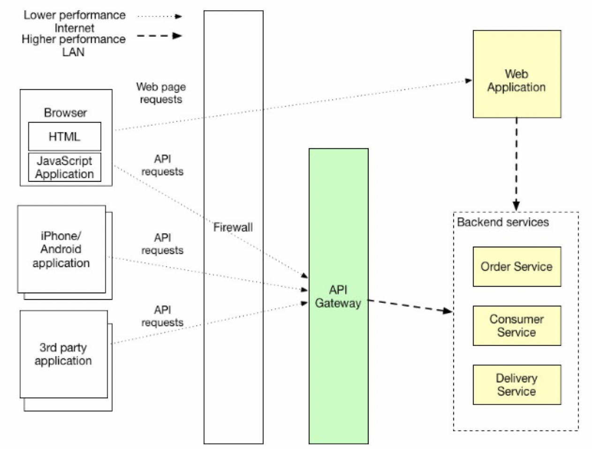
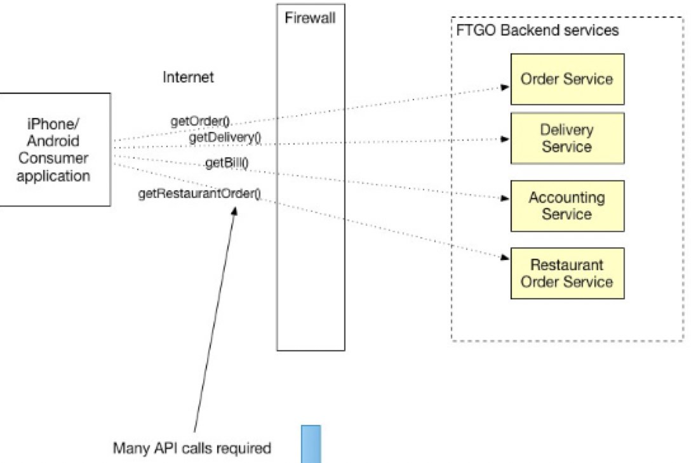
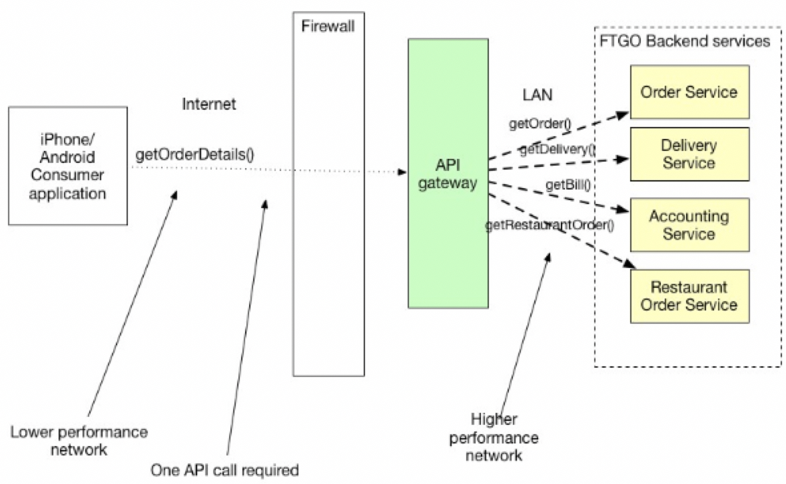

# API Gateway Overview

## API Gateway
  * 외부에 있는 `client` 가 마이크로 서비스 베이스의 어플리케이션들에 접근할 수 있는 `entry point` 서비스를 구현한다.
  * API Gateway 는 outside world에서 어플리케이션으로 진입 할 수 있는 서비스다.
  * 이러한 `API Gateway`에는 아래와 같은 책임이 있다.
    * __Request Routing (Reverse Proxy 역할)__
    * __API Composition (다양한 micro service 들로부터 API를 조합)__
    * __Authentication (인증)__
    * __그 외 다양한 부가 기능 (Rate limit)__
  * 클라이언트들이 유저에게 정보를 보여주기 위해 여러 요청을 만드는 것에 대한 단점은 잘 알려져있다.
  * 이러한 여러 요청에 대한 접근 보다 훨씬 나은 방법은 API Gateway에서 하나의 __single endpoint로 조합__ 하여 주는 것이다.
  * `API Gateway`는  방화벽 외부에서 애플리케이션에 대한 __API 요청의 단일 진입점인 서비스이다.__
  * 이것은 객체지향의 디자인 패턴 중에  `Facade pattern `과 유사하다.
    * `Facade Pattern`이란 어떤 서브시스템의 일련의 인터페이스에 대한 통합된 인터페이스를 제공하는 것이다.
    * `Facade Pattern`에서 고수준 인터페이스를 정의하기 때문에 서브 시스템을 더 쉽게 사용할 수 있다.
    * 참고 퍼사드 패턴 ) https://jusungpark.tistory.com/23
  * 퍼사드 패턴처럼 API Gateway는 내부의 구조를 캡슐화 하고, API를 클라이언트에게 제공한다.
  * API Gateway는 또한 인증, 모니터링, Rate 제한 등 다양한 책임들을 가지고 있을 수 있다.
  * 아래  이미지는 clients와 API Gateway, 그리고 서비스들에 대한 관계를 보여준다.

  

  * API Gateway는 request routing, API 조합, 그리고 protocol translation에 대한 책임이 있다.
  * 외부로 부터의 모든 API 요청은 제일 먼저 API Gateway로 진입하게 된다.
  * API Gateway는 __일부 요청들은 적절한 서비스로 라우팅한다.__
  * API Gateway는 일부 요청은 __API Composition 을 위해 여러 서비스들을 호출하고, 받은 Response 결과들을 집계하여 돌려주기도 한다.__\
  * API Gateway는 client side에 친밀한 프로토콜, 예를 들어 HTTP 그리고 Websockets 등을 서비스 어플리케이션에서 사용하는 client에게  친밀하지 않은, 익숙하지 않은 프로토콜로 변환해주는 역할도 할 수 있다 (Ex. gRPC)

## Request Routing

* API Gateway의 중요한 기능 중 하나로 request routing이 있다.
* Reqeust routing은 일부 API 요청을 일치하는 적절한 서비스로 라우팅을 수행하는 것을 의미한다.
* 한 요청을 받았을 때, API gateway는 요청을 적절한 서비스로 라우팅 하기 위해서 `routing map`에서 일치하는 서비스를 찾는다.
  * 예를 들어, 한 routing map 에서는 요청의 path 또는 method에 따라서 서비스 URL에 프록시 맵핑을 할 수 있다.
* API Gateway에 따라서 다양한 routing map에 대한 알고리즘이 존재할 수 있다.
* 이 기능은 `NGINX`의 `Reverse Proxy`와 같은 기능이라고 생각하면 이해하기 쉽다.

## API Composition

* API gateway는 일반적으로 `reverse proxying` 이상의 일을 한다.
* API gateway는 API Composition을 이용하여 일부 API 동작을 구현 할 수도 있다.
* 그러면 API Composition을 API Gateway에서 책임을 갖게 되면 어떤 차이가 있을까? 예를 들어보자.
  * 한 예로 API gateway가 없이 분산된 백엔드 서비스들로 부터 클라이언트 사이드에서 여러 요청을 통해 조합하여 사용하는 경우를 보자.

  

  * 위에 보면 여러 서비스들로 부터 클라이언트가 직접 호출을 하여 사용하고 있는 경우를 볼 수 있다.
  * 서비스는 주문 정보를 위해 Order 정보, Delivery 정보, Bill 정보, Restaurant Order 정보 등 API을 호출하고 있다.
  * 이러한 여러 API 들을 API Gateway에서 API Composition 을 통하여 interface를 `getOrderDetails` 로 추상화 해보자.

  

  * 위의 이미지를 보면 클라이언트 측에서는 order 정보를 위해 여러 정보를 호출할 필요 없이 하나의 API 를 호출하여 필요한 data를 얻을 수 있다.
  * 하지만 이런 추상화에도 단점은 있다. 여러 서비스 application으로 부터 API를 호출해서 받기 때문에, 특정 서비스에서 Fail이 되면, 장애 전파가 될 수 있다.
  * 그렇기 때문에 장애를 사전에 차단할 수 있도록 서킷 브레이커와 같은 처리가 필요하다.

## Protocol translation

* API Gateway의 다양한 역할 중 하나로 protocol 전환이 또한 있을 수 있다.
* API Gateway는 내부적으로는 REST 나 gRPC 프로토콜을 함께 사용하더라도, 외부 사용자에게는 RESTful API만 제공 할 수 있다.
* 필요할 경우에는 일부 API 에 대한 구현은 외부로 노출된 RESTful API를 내부 gRPC 기반으로 변환할 수도 있다.

참고)
https://brunch.co.kr/@springboot/38 API Gateway Pattern
https://microservices.io/patterns/apigateway.html  [API Gateway Pattern - `Single Entry Point`, `Variation Pattern`]
https://freecontent.manning.com/the-api-gateway-pattern/ [The API Gateway Pattern]
https://microservices.io/patterns/data/api-composition.html [API Composition]
