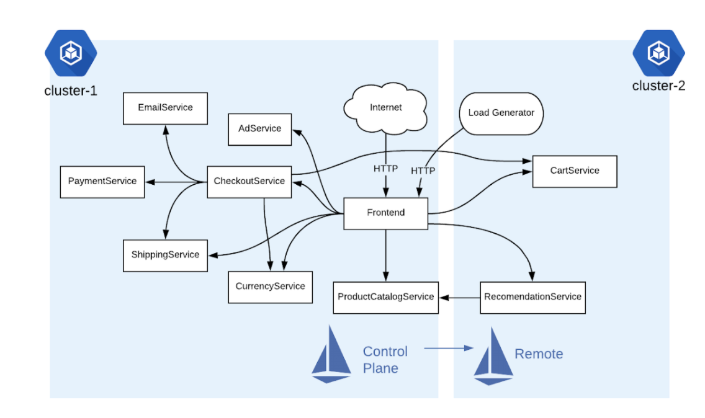
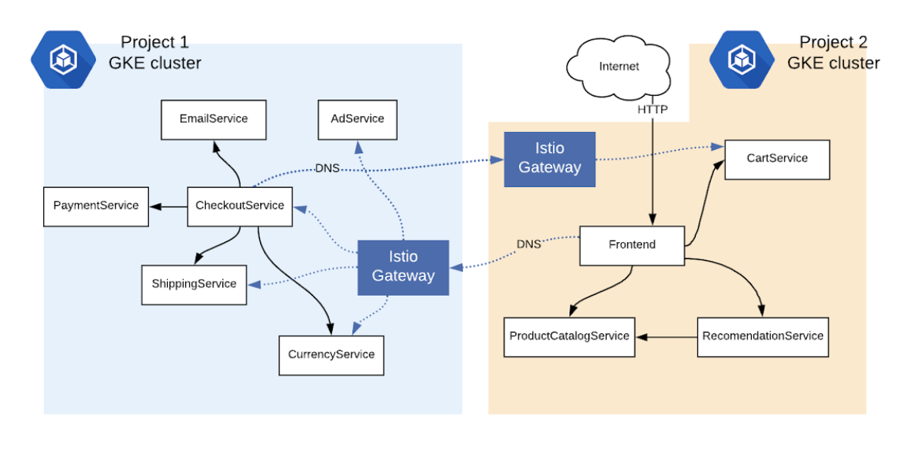
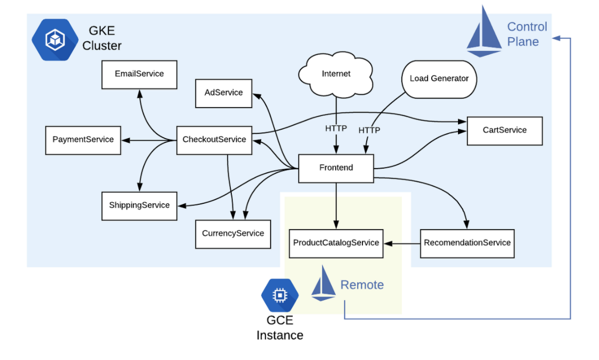

# [번역] Istio 는 미래의 Hybrid cloud 의 역할을 할 수 있다.

* 아래 글은 https://cloud.google.com/blog/topics/hybrid-cloud/the-service-mesh-era-istios-role-in-the-future-of-hybrid-cloud?hl=ko
의 번역입니다.

# 왜 하이브리드인가?

하이브리드 클라우드는 다양한 형태를 취할 수 있다. 일반적으로 하이브리드 클라우드는 private cloud (on-prem)과
public cloud 에서 운영되는것을 의미하고, 멀티 클라우드는 여러 퍼블릭 클라우 플랫폼에서 운영되는 것을
의미한다.
 하이브리드 또는 다중 클라우드 아키텍처를 채택하면 조직에 많은 이점을 제공 할 수 있다.
 예를 들어, 여러 클라우드 공급자를 사용하면 공급 업체 종속을 방지하고 목표에 가장 적합한 클라우드 서비스를 선택할 수 있다.
클라우드 및 온 프레미스 환경을 모두 사용하면 클라우드 (유연성, 확장 성, 비용 절감) 및 온 프레미스 (보안, 낮은 지연 시간, 하드웨어 재사용)의
이점을 동시에 누릴 수 있다.
 또한, 처음으로 클라우드로 전환하려는 경우 하이브리드 설정을 채택하면 비즈니스에 가장 적합한 방식으로 자신의 속도에 맞게 전환 할 수 있다.
 Google에서의 경험과 고객의 의견을 바탕으로, 애플리케이션이 컨테이너에서 실행 되든 상관없이 클라우드 및 온 프레미스 환경에서 애플리케이션 관리, 보안 및 안정성을 단순화하기 위해서는하이브리드 서비스 메시를 채택하는 것이 중요하다고 생각한다.
  Istio를 사용하여 하이브리드 서비스 메시를 현실화하는 방법에 대해 이야기 해자.

# Hybrid Istio: a mesh across environments

Istio의 주요 기능 중 하나는 워크로드 (Pods, Jobs, VM 기반 애플리케이션)에 대한 서비스 추상화를 제공한다는 것이다.
하이브리드 토폴로지로 이동하면 이 서비스 추상화가 더욱 중요해진다. 이제 하나가 아니라 걱정할 환경이 많기 때문이다.
 Istio를 채택하면 하나의 Kubernetes 클러스터에서 마이크로 서비스에 대한 모든 관리 이점 (가시성, 세분화 된 트래픽 정책, 통합 원격 분석 및 보안)을 얻을 수 있다.
 그러나 여러 환경에서 Istio를 채택하면 효과적으로 애플리케이션에 새로운 강력한 힘을 제공하게 된다.
 Istio는 Kubernetes의 서비스 추상화가 아니기 때문이다. Istio는 환경 전반에서 네트워킹을 표준화하는 방법이기도 하다.
API 관리를 중앙집중화하고 JWT 인증은 코드레벨에서 따로 분리하는 방법이기도 하다.
그렇다면 이러한 마법들은 어떻게 발생하는걸까? 하이브리드 Istio는 환경 (모든 VM, 모든 컨테이너)의 모든 서비스 옆에 위치하며 경계를 넘어 서로 통신하는 방법을 알고있는 사이드카 Istio 프록시 (Envoy) 세트를 의미한다.
 몇가지 예제를 살펴보자.

# Multicluster Istio, one control plane

* [데모링크] https://github.com/GoogleCloudPlatform/istio-samples/tree/master/multicluster-gke/single-control-plane

하이브리드 Istio를 활성화하는 한 가지 방법은 중앙에서 실행되는 Istio control plane에 "호출"하는 원격 Kubernetes 클러스터를 구성하는 것이다
 이 설정은 동일한 GCP 프로젝트에 여러 GKE 클러스터가 있지만 두 클러스터의 Kubernetes 포드가 서로 통신해야하는 경우에 유용하다.
이를 위한 사용 사례에는 새로운 기능을 카라니 배포를 할 수있는 프로덕션 및 테스트 클러스터, 장애 조치를 처리 할 준비가 된 대기 클러스터, 영역 또는 지역의 중복 클러스터가 포함된다.
 이 데모는 동일한 프로젝트에서 두 개의 다른 영역 (us-central 및 us-east)에 걸쳐 두 개의 GKE 클러스터를 가동한다.
  한 클러스터에 Istio 컨트롤 플레인을 설치하고 다른 클러스터에 Istio의 원격 구성 요소 (사이드카 프록시 인젝터 포함)를 설치한다.
  여기에서 두 Kubernetes 클러스터에 걸쳐 샘플 애플리케이션을 배포 할 수 있다.

  

이 단일 제어 플레인 접근 방식의 흥미로운 점은 마이크로 서비스가 서로 통신하는 방식에 대해 아무것도 변경할 필요가 없다는 것이다.
 예를 들어 프런트 엔드는 여전히 로컬 Kubernetes DNS 이름 (cartservice : port)으로 CartService를 호출 할 수 있다.
이 DNS 확인은 동일한 GCP 프로젝트의 GKE 포드가 동일한 가상 네트워크에 속하기 때문에 작동하므로 클러스터간에 포드 간 직접 통신이 가능하다.

# Multicluster Istio, two control planes

* [데모링크] https://github.com/GoogleCloudPlatform/istio-samples/tree/master/multicluster-gke/dual-control-plane

이제 기본적인 다중 클러스터 Istio 예제를 보았으므로 다른 데모를 통해 한 단계 더 나아가 보자.

이 데모는 클러스터 당 하나씩 두 개의 Istio 컨트롤 플레인을 사용하여 단일 양방향 논리적 서비스 메시를 형성한다.
사이드카 프록시가 서로 직접 통신하지 않고 Istio의 Ingress Gateway를 사용하여 클러스터간에 트래픽이 이동한다.
Istio 게이트웨이는 또 다른 Envoy 프록시 일 뿐이지만 특히 단일 클러스터 Istio 메시에서 들어오고 나가는 트래픽 전용이다.

이 설정이 네트워크 파티션에서 작동하려면 각 Istio 컨트롤 플레인에 특수 도메인 이름 서버 (DNS) 구성이 있다.
이 이중 제어 평면 토폴로지에서 Istio는 로컬 클러스터 외부의 서비스에 대한 도메인 이름을 확인하는 보조 DNS 서버 (CoreDNS)를 설치한다.
이러한 외부 서비스의 경우 트래픽은 Istio Ingress Gateway간에 이동 한 다음 관련 서비스로 이동한다.
 이 토폴로지의 데모에서는 이 설치가 작동하는 방식을 보여준 다음 두 클러스터에서 실행되는 마이크로 서비스가 서로 통신하도록 구성하는 방법을 보여준다.
 Istio ServiceEntry 리소스를 통해 이를 수행합니다. 예를 들어 프런트 엔드 (클러스터 2)에 대한 서비스 항목을 클러스터 1에 배포한다.
이러한 방식으로 클러스터 1은 클러스터 2에서 실행되는 서비스에 대해 알고 있다.
첫 번째 데모와 달리이 이중 제어 플레인 Istio 설정에는 클러스터간에 플랫 네트워크가 필요하지 않는다.
즉, 클러스터간에 GKE 포드 CIDR이 겹칠 수 있다. 이 설정에 필요한 것은 Istio 게이트웨이가 인터넷에 노출되는 것뿐이다.
이러한 방식으로 각 클러스터 내부의 서비스는 각자의 환경에서 안전하게 유지 될 수 있다.

# Adding a virtual machine to the Istio mesh

* [데모링크] https://github.com/GoogleCloudPlatform/istio-samples/tree/master/mesh-expansion-gce

이번에는 Istio 를 virtual machine 에 추가하는 것을 살펴보자. (사실 이 부분이 제일 궁금했음)
많은 조직에서 가상 머신 (VM)을 사용하여 컨테이너 대신 (또는 추가로) 애플리케이션을 실행한다.
VM을 사용하는 경우에도 Istio 메시의 이점을 누릴 수 있다.
 이 데모는 Google Compute Engine 인스턴스를 GKE에서 실행되는 Istio와 통합하는 방법을 보여준다.
이전과 동일한 애플리케이션을 배포한다. 그러나 이번에는 하나의 서비스 (ProductCatalog)가 Kubernetes 클러스터 외부의 외부 VM에서 실행된다.

이 GCE VM은 중앙 Istio 컨트롤 플레인과 통신 할 수 있도록 최소한의 Istio 구성 요소 집합을 실행한다.
그런 다음 Istio ServiceEntry 객체를 GKE 클러스터에 배포하여 외부 ProductCatalog 서비스를 메시에 논리적으로 추가한다.
 이 Istio 구성 모델은 이제 다른 모든 마이크로 서비스가 마치 Kubernetes 클러스터 내부에서 실행되는 것처럼 ProductCatalog를 참조 할 수 있기 때문에 유용하다.
 여기에서 마치 Kubernetes에서 실행되는 것처럼 ProductCatalog에 대한 Istio 정책 및 규칙을 추가 할 수도 있습니다. 예를 들어 VM에 대한 모든 인바운드 트래픽에 대해 상호 TLS를 활성화 할 수 있습니다.
__이 데모에서는 데모 목적으로 Google Cloud VM을 사용하지만 베어 메탈 또는 온 프레미스 VM에서 동일한 예제를 실행할 수 있습니다.__
 이러한 방식으로 Istio의 현대적인 클라우드 네이티브 원칙을 어디서나 실행되는 가상 머신에 적용 할 수 있습니다.
