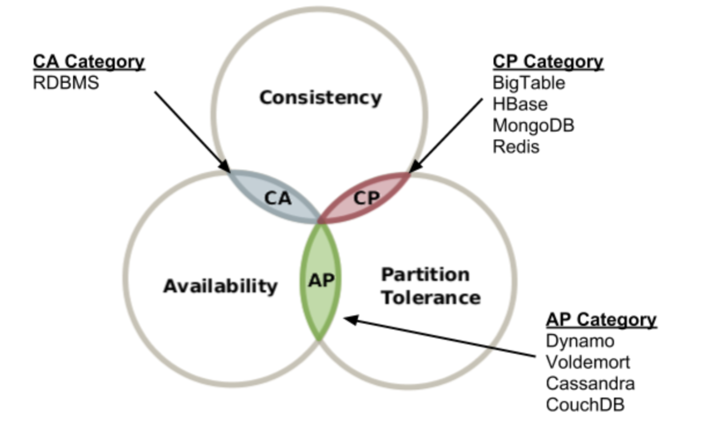
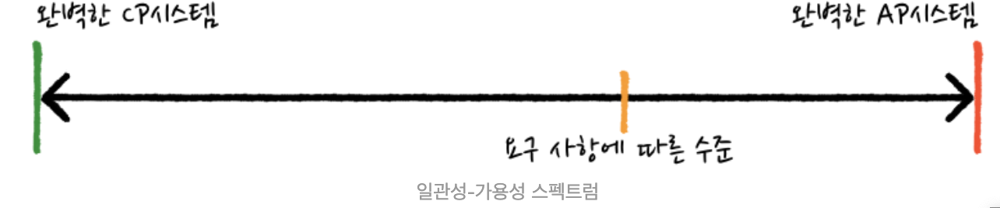

# CPA 이론과 모순

서비스의 요구사항이 다양해지고, 이에 맞추어 다양한 분산 데이터 베이스 시스템이 개발되었다.

BigTable
MongoDb
Dynamo
Redis
...
우리는 이 중에서 우리 서비스에 맞는 적절한 시스템을 결정해야 한다.

어떤 기준으로 적절한 분산 데이터 베이스 시스템을 선택할 수 있을까?

이런 선택에 도움을 줄 수 있도록 고안된 이론이 CAP 이론이다.

## Overview

CAP 이론은 __어떠한 분산 데이터 베이스 시스템도 일관성 (Consistency), 가용성 (Availability), 네트워크 파티션 허용 (Partition tolerance) 중에 3가지를 동시에 만족 시킬 수 는 없다는 이론이다.__
3가지 특성의 머리글자를 빌어서 CAP 이론이라고 한다.

## 각각의 요소에 대한 설명




* Availability (가용성)
  * 모든 요청은 정상 응답을 받는다.
  ```
  [예시]

  DB가 A, B, C 노드로 분산되어 있는 환경을 생각해보자.
  B 노드가 갑자기 천재지변으로 인해 유실되어 있다고 해보자. 하지만, A, C 노드는 살아 있어서 A, C 노드로 계속해서 유저에게 서비스를 할 수 있다면,
  이는 가용성 있는 시스템이라고 할 수 있다.
  ```
* Consistency (일관성)
  * 모든 노드들은 같은 시간에 동일한 항목에 대하여 같은 내용의 데이터를 사용자에게 보여준다.
  ```
  [예시]

  DB 가 A, B, C 노드로 분산되어 있는 환경을 생각해보자.
  A 노드에 돈 1000원이 저장되어 있는데, 이것을 2000원으로 변경했다.
  그럼 이 변경 사항은 Replication 기능에 의해 B, C 노드에도 반영될 것이다.
  하지만, 상식적으로 A 노드의 변경사항이 B, C 노드까지 전달되기에는 시간이 필요하다.
  이 때, B나 C 노드에 접근한 유저를 변경사항이 완전히 반영될 때까지 기다리게 하면 최신 데이터인 2000원을 반환할 수 있게 된다.
  이는 일관성 있는 시스템이라고 할 수 있다.
  ```

* Partition tolerance (네트워크 파티션 허용)
  * 노드간 많은 메세지를 주고 받다가 네트워크 장애가 발생한다면 허용하는 지에 대한 것이다.

## CP, AP, CA 와 CAP 이론의 모순

3가지 중에 각각 2가지 씩을 선택하면 CP, AP, CA 가 만들어진다. 각각에 대해서 살펴보자.

* 완벽한 AP 시스템 (가용성 & 네트워크 파티션 허용)
  * 완벽한 가용성을 갖는 분산 시스템에서는 모든 노드가 어떤 상황에서도 응답할 수 있어야 한다. 네트워크 문제가 발생해서
  어떤 노드에 Replication 이 제대로 이루어지지 않아도 가용성을 위해서 해당 노드에 접근한 사용자에게 데이터를 반환한다고 생각해보자.
  일관성이 깨진것은 당연하고 사용자는 문제가 발생한 것을 인지하지 못할 것이다.

* 완벽한 CP 시스템 (일관성 & 네트워크 파티션 허용)
  * 완벽한 일관성을 갖는 분산 시스템에서 데이터 변경은 존재하는 모든 노드에 복제되어야 완료된다.
  이는 가용성과 성능에 크나큰 악영향을 끼친다. 만약 하나의 노드라도 문제가 있으면 트랜잭션은 실패한다.
  그리고 노드가 늘어날 수록 지연시간은 길어진다.

* 완벽한 CA 시스템 (일관성 & 가용성 허용)
  * CA 시스템은 P 를 배제한 것이다. P는 무엇인가? "네트워크 장애상황에 장애를 허용하는가?" 이다.
  P를 배제한다는 것은 곧 네트워크 장애가 절대 일어나지 않는다는 것을 의미한다. 그것이 가능한가? 그렇지 않다.
  그렇기 때문에 CA 시스템 이라는 것 자체는 모순이다.
  물론, CAP 이론을 정립한 Brewer 가 처음 발표할 때, CA 시스템의 예로 RDBMS 를 얘기했지만, CAP 이론은 분산 시스템이
  전제 조건이기 때문에 이는 옳은 예시는 아니라고 할 수 있다.


CAP 이론은 사실 완전한 이론은 아니다. 다양한 분산 데이터베이스 시스템을 완전히 설명해주지 못하기 때문이다.
실제적으로 각각의 분산 데이터 베이스들을 살펴보면 일관성이나 가용성은 완전하게 대칭을 이루는 개념이 아니라는 것을 알 수 있다.
한 예시로 Cassandra 와 HBase 를 살펴보자.

* Cassandra 는 AP 를 선택한 것으로 알려져 있다.
  하지만, Cassandra 는 네트워크 장애 상황이던 네트워크 장애 상황이 아니던 항상 일관성은 만족하지 못한다.

* HBase 는 CP 를 선택한 것으로 알려져 있다.
  하지만 HBase 는 네트워크 장애 상황 때만 가용성을 포기하고 정상일 때는 가용성을 만족한다.


즉, CAP 이론은 네트워크가 장애 상황일 때만 A와 C 가 대칭성이 있고, 네트워크가 장애 상황이 아닐때는 그렇지 않다는 것이다.
CAP 이론의 이러한 모순들을 해결하기 위해서는 CAP 이론을 적용하는 문제를 국한시켜야 한다.
 네트워크 장애 허용 (P) 에 관한 것은 인정할 수 밖에 없는 대전제이므로, 처음부터 이미 선택이 되어져 있는 것이다.

결국 CAP 이론이 내포하고 있는 의미는 __"분산 시스템에서 네트워크 장애상황일 때, 일관성과 가용성 중 많아도 하나만 선택할 수 있다."__
는 것이다.

 물론, 어느 한쪽을 완벽하게 만족하다기 보다는 요구사항에 따라서  "다소 강한 일관성 - 다소 약한 가용성", "다소 약한 일관성 - 다소 강한 가용성"과 같이
선택될 수 있다.



그렇다면, 네트워크가 정상 상황일 때는 어떤가? 이를 보완하기 위해 CAP 이론에 네트워크가 정상 상황인 경우를 추가한 PACELC 이론이 제시되었다.
이것은 다음 포스트에서 다루도록 하겠다.

## 참고)

* https://m.blog.naver.com/PostView.nhn?blogId=windfalcon1&logNo=220402574806&proxyReferer=https:%2F%2Fwww.google.com%2F
* https://ohjongsung.io/2019/05/01/cap-%EC%9D%B4%EB%A1%A0%EA%B3%BC-pacelc-%EC%9D%B4%EB%A1%A0
* http://happinessoncode.com/2017/07/29/cap-theorem-and-pacelc-theorem/
* http://eincs.com/2013/07/misleading-and-truth-of-cap-theorem/
