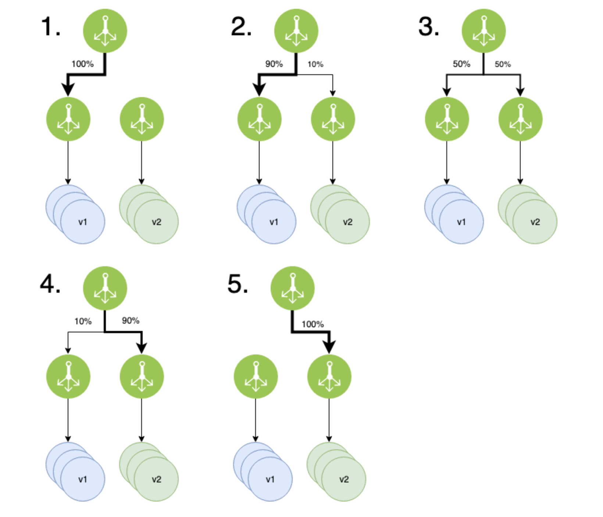

# Canary 배포 전략

* 예전에는 거대한 프로젝트 코드들을 한번에 배포를 했다.
  * 그래서 배포를 하는 날이면 사람들 접속이 뜸한 새벽 시간부터 배포를 시도하고, 배포에 실패하면 빠르게
  롤백을 진행했다.
  * 즉, 모노레틱한 큰 서버를 배포하는 것은 cost가 높은 작업이였다.
* 모노레틱 구조에서 MSA로 바뀌며 서비스들은 작은 크기로 분할되었고, 배포는 `빠르고 자주` 하는 것으로
바뀌어졌다.
* 이런 트랜드에 변화에 맞춰 배포 전략도 다양하게 개발되고 발전되어 왔다.
* 그 중에서 오늘은 Canary에 대해서 공부해보고자 한다.
* Canary 용어의 뜻은 무엇일까?
  * Canary는 카나리아 라는 새를 일컫는 말이다. 이 새는 일산화탄소 및 유독가스에 매우 민감하다고 한다.
  그래서 과거 광부들이 이 새를 옆에 두고 광산에서 일을 하다가 카나리아가 갑자기 죽게 되면 대피를 했다고 한다.
* 즉, Canary 배포란 __위험을 빠르게 감지하는 데에 사용하는 배포 전략__ 이다.
* 이 기법은 여러대에 인스턴스 중 일부만 새 버전으로 배포를 한다.
* 만약 인스턴스가 10대가 있고, 그중에 1대만 새로운 버전으로 배포를 한다고 해보자.
* 그럴 경우 약 10%의 트래픽만 새로운 버전으로 부하가 될 것이다.
* 만약 이 때, 문제가 발생한다면, rollback을 한다.
* 문제가 발생하지 않는다면, 20%, 30%, 40% ... 점진적으로 새로운 버전으로 인스턴스를 배포하는 방법이다.

