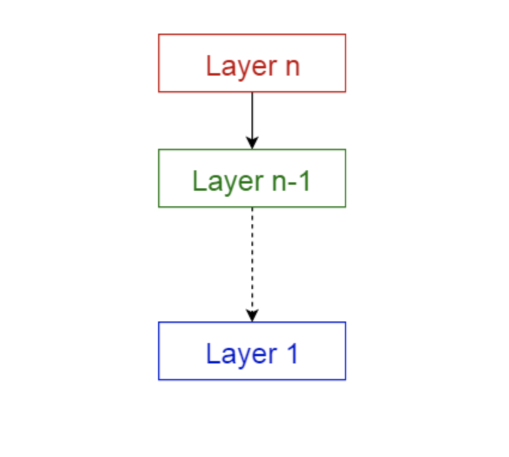

# 10가지 소프트웨어 아키텍처 패턴 - 계층화 패턴

## 계층화 패턴

* 이 패턴은 `n-티어 아키텍처 패턴`이라고도 불린다.
* 이는 하위 모듈들의 그룹으로 나눌 수 있는 `구조화된 프로그램`에서 사용할 수 있다.
* 각 하위 모듈들은 `특정한 수준의 추상화`를 제공한다.
* 각 계층은 `다음 상위 계층에 서비스`를 제공한다.



```
* 프레젠테이션 계층 (Presentation layer) - UI 계층 (UI layer) 이라고도 함
* 애플리케이션 계층 (Application layer) - 서비스 계층 (Service layer) 이라고도 함
* 비즈니스 논리 계층 (Business logic layer) - 도메인 계층 (Domain layer) 이라고도 함
* 데이터 접근 계층 (Data access layer) - 영속 계층 (Persistence layer) 이라고도 함
```

## 활용

* 일반적인 데스크톱 애플리케이션
* E-commerce 웹 애플리케이션
