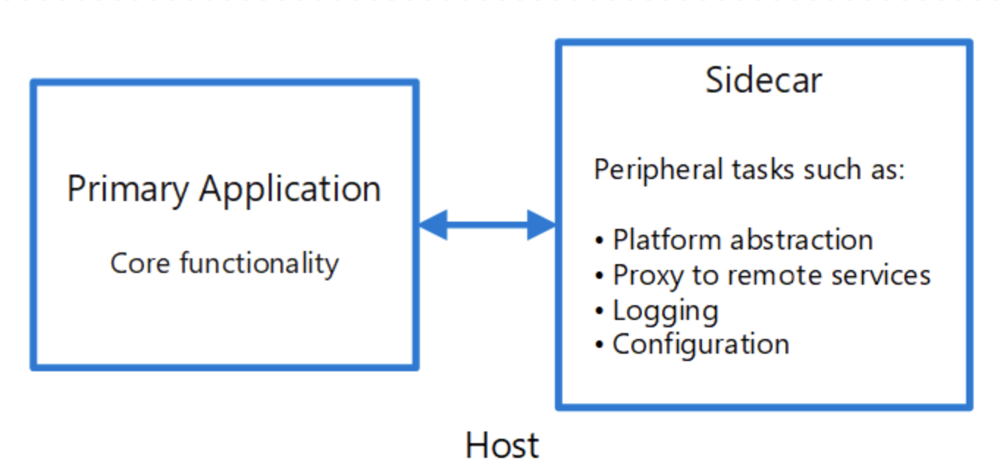

# 사이드카 패턴

* `사이드카 패턴`은 `어플리케이션 컨테이너`와 `독립적으로 동작하는 별도의 컨테이너`를 붙이는 패턴이다.
`어플리케이션 컨테이너`의 변경이나 수정 없이 `독립적으로 동작하는 컨테이너`를 붙였다 뗐다 할 수 있다.

* 이것이 가능한 이유는 두 개의 프로세스가 서로 통신하는 구조이기 때문이다.

* 이런 사이드카 패턴으로 2가지 예시를 생각해보면 쉽게 이해할 수 있다.
  * 사례 1. Google Cloud SQL : google cloud sql은 sidecar pattern으로 docker container를 제공한다.
  Cloud SQL에 application 에서 접근하기 위해서는 이 sidecar pattern으로 접근해야만 Cloud SQL에 접속 할 수 있다.
  * 사례 2. spring cloud sidecar : spring cloud에서는 Non-JVM Application
  에서도 spring-cloud를 사용할 수 있도록 sidecar를 제공한다. 이를 통해 자바 스프링 기반이 아닌 서버에서도
  zuul gateway, Eureka 등을 local 통신을 통해 접근하여 사용할 수 있다.

  

* 장점과 단점
  * 장점 : 기존 어플리케이션과 분리된 별도의 기능을 다른 컨테이너에서 개발이 가능.
  * 단점 : 너무 작은 기능으로 쪼갤 경우, 관리 비용이 늘어난다.
