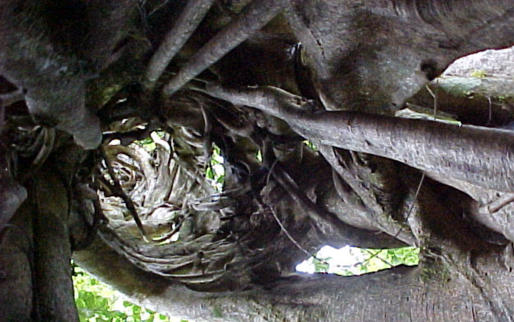
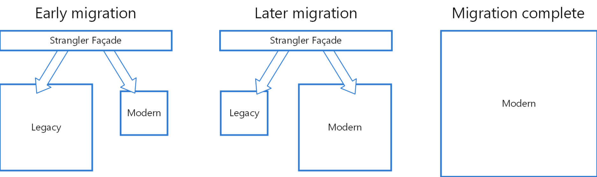

# Strangler Pattern

* __레거시 시스템을 점진적으로 교체하여 레거시 시스템을 단계적으로 페이드아웃한다.__
* 레거시 시스템의 일부를 새로운 애플리케이션이나 서비스로 교체한다.
* 일정 기간이 지난 후, 대체된 레거시 기능을 제거한다.
* 위의 두 작업을 반복한다.
* 주로 백엔드 애플리케이션을 전체적으로 새로운 아키텍처로 구성해야 할 필요가 있을 때 사용하는 패턴이다.
* 단기간에는 이룰 수 없으며 여러 해에 걸쳐 많은 개발자가 필요하다.
* 이 패턴은 마틴 파울러가 여행을 가서 아이디어를 얻었다.
* `교살자 무화과`를 보면서 나무의 윗 가지에 씨를 뿌리고 토양에 뿌리를 내릴 때 까지 점차 나무 아래로
내려간다.
* 이러다가 결과적으로 기생한 나무를 교살해서 죽였다.
* __오래된 기능들은 그대로 동작하면서 새로운 것이 추가되어야 한다.__
* 참고로 마틴 파울러는 `교살자 어플리케이션`의 이름이 너무 폭력적이라 추후에 `교살자 무화과 어플리케이션`으로 변경
하였다.

## 스트랭글러 패턴 적용을 조금 더 살펴보자.

* 특정 부분의 기능을 새로운 어플리케이션으로 대체한다.
* 레거시 시스템을 대체할 수 있는 새로운 서비스를 만든다. (일부기능 포함)
* 요청을 새로운 서비스로 라우팅을 한다.
* 이런 작업을 반복하다보면 점점 legacy 영역은 작아지게 되고, 결과적으로 새로운 아키텍처 구조로
변경이 일어날 수 있다.
* __중요한 것은 점짐적으로 구조를 개선해 나가는 것이다.__
* 이와 반대되는 패턴으로는 __빅뱅 패턴__ 으로 한번에 전환하는 것이다.
* 한번에 바꾸는 것은 매우 위험하며, 기업의 비즈니스 또한 건들 수 있기 때문에 추천되지는 않는다.
