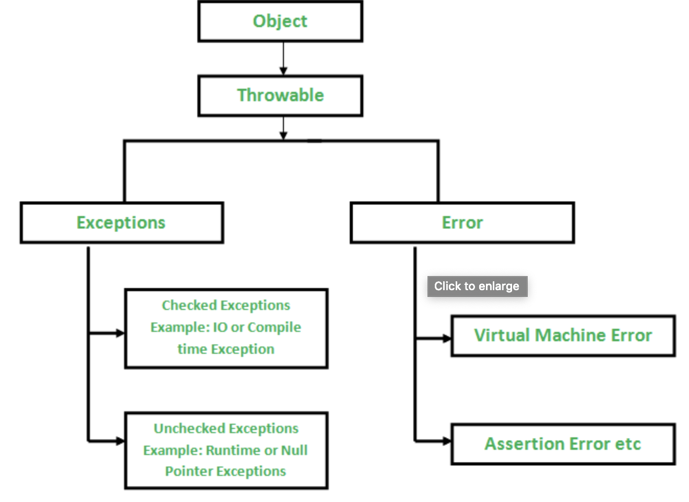

# [Java] Java의 예외처리
---

## 예외란? (Error vs Exception)
---

* 먼저 오류(Error)와 예외(Exception)의 개념을 정리하고 넘어가자.
* 오류(Error)는 시스템에 __비정상적인 상황이 생겼을 때 발생한다.__
* 이는 시스템 레벨에서 발생하기 때문에 심각한 수준의 오류이다.
* 따라서 __개발자가 미리 예측하여 처리할 수 없기 때문에, 애플리케이션에서 오류에 대한 처리를 신경 쓰지 않아도 된다.__
* 오류가 시스템 레벨에서 발생한다면, __예외(Exception)는 개발자가 구현한 로직에서 발생한다.__
* 즉, __예외는 발생할 상황을 미리 예측하여 처리할 수 있다.__
* 즉, __예외는 개발자가 처리할 수 있기 때문에 예외를 구분하고 그에 따른 처리 방법을 명확히 알고 적용하는 것이 중요하다.__

## 예외클래스
---



* 위 그림은 예외 클래스의 구조이다.
* 모든 예외 클래스는 `Throwable` 객체를 상속받고 있다.
* Throwable 을 상속받는 클래스는 `Error` 와 `Exception` 이 있다.
* `Error`는 시스템 레벨에서 심각한 수준의 에러이기 때문에 시스템에 변화를 주어 문제를 처리해야
하는 경우가 많다.
  * VirtualMachineError
    - Out Of Memory (OOM) 에러 : 자바의 heap 메모리 부족으로 object 를 더이상 할당할 수 없을 때
    발생하는 에러
    - Stack Over Flow 에러 : 자바의 스택 영역의 메모리가 지정된 범위를 넘어설 때 발생하는 에러
    - ...
  * LinkageError
    - NoClassDefFoundError : 동적 클래스 로더에서 특정 클래스 파일을 찾을 수 없을 때 발생하는 에러
    - BootstrapMethodError
    - ...
* 반면에 `Exception`은 개발자가 로직을 추가하여 처리할 수 있다.
* Exception 은 runtime 에 발생하는지에 대한 여부에 따라 `CheckedException` 과 `UnCheckedException`
으로 구분할 수 있다.

## Checked Exception과 Unchecked(Runtime) Exception
---

* Checked exception
  * Checked exception 은 컴파일 타임에 체크 된다.
  * 만약에 어떤 메서드 안에서 Checked exception 을 throw 한다면 그 메서드는 반드시
  Exception 을 handle 하거나 또는 핸들링을 하지 않고 전파를 위해 메서드 시그니쳐에 `throws` 키워드를
  붙여줘야 한다.
  * 즉, 에러 처리가 컴파일러에 의해서 강제된다.
* UnChecked exception  
  * UnChecked exception 은 런타임에 체크 된다.
  * 컴파일러가 해당 Exception 을 처리하도록 강제하지 않는다.
  * 그렇기 때문에 이에 대한 처리는 프로그래머에 에러 처리 정책에 따라 다르다.
  * 직접 catch 를 해서 처리하거나 하지 않을 수 있다.
* Checked Exception 과 UnChecked Exception 의 가장 명확한 구분 기준은 __꼭 처리를 해야하는가__ 이다.  
* 하나의 예를 통해서 좀 더 명확하게 차이를 살펴보자.
* 아래와 같은 Java App 에서 컴파일러는 아래와 같은 코드를 허용한다.
* 하지만, 만약 실행을 하게되면, `ArithmeticException` 이 발생한다.
* __`ArithmeticException` 이 UnChecked exception 이기 때문에 컴파일러 코드를 허용하여 실행이
된 것이다.__

```
class Main {
   public static void main(String args[]) {
      int x = 0;
      int y = 10;
      int z = y/x;
  }
}
```

## 예외를 처리하는 방법

```
* 1) 예외 복구 : 다른 작업 흐름으로 유도한다.
* 2) 예외처리 회피 (예외 떠넘기기): 처리를 하지 않고 호출한 쪽으로 throw
* 3) 예외 전환 : 좀 더 명확한 예외로 전환 후 throw
```

* 예외를 처리하는 방법은 위와 같은 3가지 방식이 일반적이다.
* 주의해야 할 것은 try/catch 문으로 예외를 잡아놓고 catch 에 아무런 처리도 하지 않으면
위험한 행위가 될 수 있다.
* 예외가 발생했을 때 에러 트래킹 하기가 어려워지기 때문이다.


### 참고)

* https://www.geeksforgeeks.org/checked-vs-unchecked-exceptions-in-java/
* http://www.nextree.co.kr/p3239/
