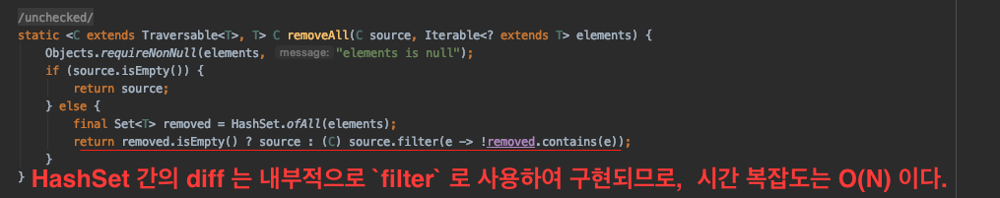
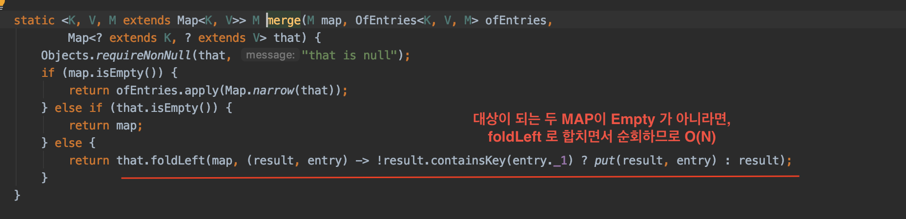
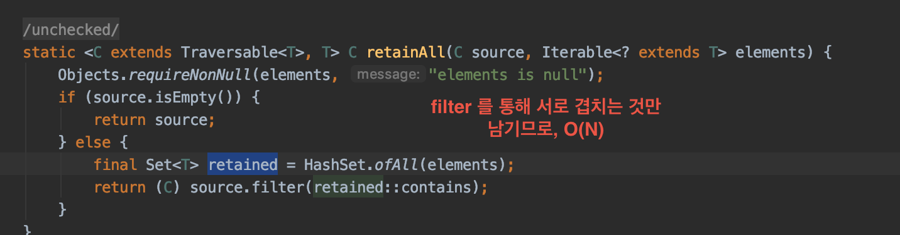

# [Java Functional liabrary vavr] Set 사용해보기

* vavr 의 set 자료구조를 사용해보자.
* set 자료구조는 흔히 알려져 있는대로 '집합' 자료 구조로 중복을 허용하지 않는다.
* vavr 도 set 불변 set 자료구조를 지원하는데 `HashSet`, `LinkedHashSet` 등을 제공한다.

```
HashSet<Integer> a = HashSet.of(1, 2, 3, 4, 5);
HashSet<Integer> b = HashSet.of(3, 4, 5, 6, 7);

a.merge(b); //합집합 : HashSet(1, 2, 3, 4, 5, 6, 7)

a.diff(b); //차집합 : HashSet(1, 2)

a.intersect(b); //교집합 : HashSet(3, 4, 5)
```

* 위의 예제를 보면 알 수 있듯이, 중복을 허용하지 않는 Set 의 특성과 집합의 `합집합`, `차집합`, `교집합`
등의 API 를 제공해준다.
* 그렇다면 각각의 API 시간복잡도나 내부 구현은 어떨까?

## diff API



* 차집합의 경우는 내부적으로 filter 를 통해서 구현되어있고, 그렇기 때문에 `O(N)` 시간이다.

## merge API



* 합집합의 경우에는 `foldLeft` 를 이용해서 왼쪽부터 오른쪽으로 순회하며 합치기 때문에  `O(N)`
시간이다.


## intersect API



* 교집합의 경우에는 내부적으로 `filter` 를 이용해서 겹치는 것만 남기므로, `O(N)` 이다.


## 결론

* `Set` 자료구조는 `contatins` 함수를 통해서 중복되어있지 않은 엘리먼트에서 값을 찾는 데에 `O(1)`
이라는 성능을 보여준다.
* 또한, `집합`의 다양한 개념들을 `API`로 구현해놨기 때문에 비즈니스 로직에 따라서 활용하기에 좋다.
* `Vavr` 는 불변의 Set 데이터 구조를 구현하였기 때문에, `map`, `filter`, `flatMap` 등 다양한
함수 오퍼레이션 또한 사용할 수 있다.
