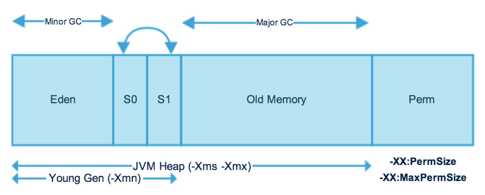
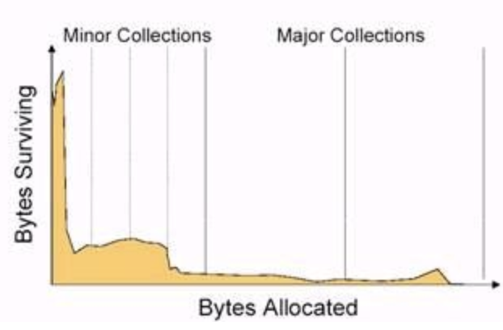
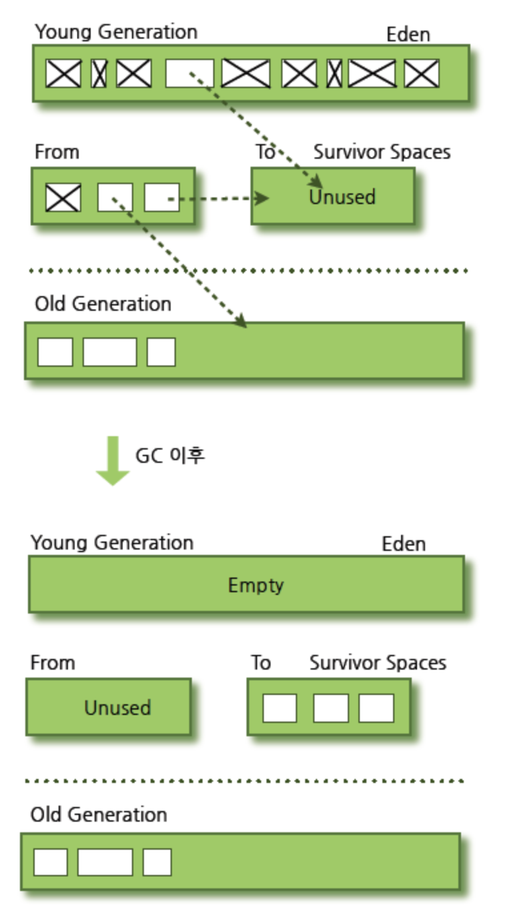

# GC (Garbage Collector)란?

## 가비지 컬렉터를 알아보기 전, 가비지에 대해서 알아보자.

```
int [] array = new int[2]; //메모리 주소 : foo

array[0] = 0;
array[1] = 1;

array = new int[3]; //메모리 주소 : bar
```

* 위의 코드에서 array 변수는 새롭게 다시 할당이 되는 것을 알 수 있다.
* 그렇다면 기존의 메모리 주소 `array -> foo` 를 가리키던 것이 'array -> bar' 를 가리키게 되면서
기존의 `foo`는 어떻게 되었을까?
* `foo` 메모리를 참조하는 객체가 사라지게 되면서 `foo`에는 접근을 할 수가 없게 되었다.
* 이런 것을 주소를 잃어 버리게 되었기 때문에 `Dangling Object` 이라고 한다.
* 자바에서는 `Garbage` 라고도 한다.
* 이러한 `Garbage` 를 처리하지 않으면 어떻게 될까? 메모리 공간을 낭비하게 될 것이다.
* `C 언어`의 경우에는 메모리를 관리해주지 않기 때문에, 직접 메모리 할당 해제를 코드 레벨에서
처리를 해주어야 한다.
* `JAVA` 에서는 이러한 처리를 개발자가 코드레벨에서 처리하는 것이 아닌 `JVM` 의 `Garbage Collector`
가 처리를 해준다.
* 즉, __메모리 할당 해제를 JVM이 대신 수행해준다는 의미이다.__

## Stop the world

* `Stop the world` 는 GC 실행을 위해서 JVM이 애플리케이션 실행을 정지시키는 것을 의미한다.

```
[청소부 Garbage Collector]

JVM : 지금 부터 청소할 거니까 다들 잠깐 밖에서 기다리세요!
Application : 네네. 기다릴게요.
```

* 마치 화장실 청소를 위해서 화장실 출입금지를 하는 것과 비슷한(?) 것 같다.
* 자. `Stop the world` 가 시작되면, 출입할 수 있는 것은 GC 를 수행하는 스레드 뿐이다.
* __다른 스레드들은 모두 작업을 멈추게 된다.__
* 여기에서 `Stop the world`의 시간은 성능의 지대한 영향을 끼치게 된다.
* __그래서 우리는 적절한 GC 튜닝을 통해서 `STOP THE WORLD`의 시간을 줄이려고 한다.__

## GC를 잘 이해하려면 JVM의 힙 메모리 구조를 알아야한다.

* 우리는 GC 알고리즘과 튜닝을 알아보기 전에 JVM의 메모리 구조가 어떤지에 대해서 살펴볼 필요가 있다.
* 청소를 하려면 __어디를 청소하는 것인지 알아야 하기 때문이다.__



* java의 HEAP Area는 크게 보자면 `Yong`과 `Old`로 나누어져있다.
* JVM의 힙 구조를 설계할 때, 두 가지 가설 아래에서 만들어졌다.
  1) 대부분의 객체는 __금방 접근 불가능 상태 (unreachalbe)가 된다.__
  2) __오래된 객체__ 에서 __젊은 객체__ 로의 참조는 아주 적게 존재한다.



* 위와 같은 가설을 `weak generational hypothesis` 이라고 한다.
* 이러한 가설 아래에서 JVM의 힙 구조는 `Yong`과 `Old` 로 나누어져 있는 것이다.

```
Yong 영역 (Eden & Survivor):
  - 새롭게 생성한 객체의 대부분이 여기에 위치한다
  - 대부분의 객체가 금방 접근 불가능 상태가 되기 때문에 매우 많은 객체가 Young 영역에 생성되었다가 사라진다.
  - 이 영역에서 객체가 사라질때 Minor GC가 발생한다고 말한다.

Old 영역 :
  - 접근 불가능 상태로 되지 않아 Young 영역에서 살아남은 객체가 여기로 복사된다.
  - 대부분 Young 영역보다 크게 할당하며, 크기가 큰 만큼 Young 영역보다 GC는 적게 발생한다.
  - 이 영역에서 객체가 사라질 때 Major GC(혹은 Full GC)가 발생한다고 말한다.
```

## Yong 영역의 GC (Minor GC) 와 Old 영역의 GC (Major GC)

* `Yong` 영역은 `Eden` 영역과 `Survivor` 영역으로 나누어진다.
  - Eden 영역
  - Survivor 영역 (2개)
* 위와 같이 이루어진 `Yong` 영역에서 발생하는 GC 를 `Minor GC` 라고 한다.
* `Minor GC` 의 과정을 살펴보자
  1) 새로 생성된 대부분의 객체는 Eden 영역에 위치한다.
  2) Eden 영역에서 GC가 한번 발생 한 후, 살아남은 객체는 `Survivor` 영역 중 한 곳으로 이동된다.
  3) Eden 영역에서 GC가 발생할 때마다 살아남은 객체는 (2) 에서 이동된 `Survivor` 영역으로 객체가 계속 이동된다.
  4) 하나의 Survivor 영역이 가득 차게 되면, 그 중에서 살아남은 객체를 다른 `Survivor` 영역으로 이동하고,
  가득찬 `Survivor`는 아무 데이터가 없는 빈 상태가 된다.
  5) 위와 같은 과정을 반복하다가 계속 해서 살아남는 객체는 `Old` 영역으로 가게 된다.

  

* 이후, `Old` 영역에서 GC가 발생하게 되면 이를 `Major GC` 라고 한다.
* `Old` 영역은 `Yong` 영역보다 일반적으로 크기가 크기 때문에 Minor GC에 비해 더 큰 오버헤드를 야기한다.

### 참고)

* https://d2.naver.com/helloworld/37111
* https://d2.naver.com/helloworld/1329
