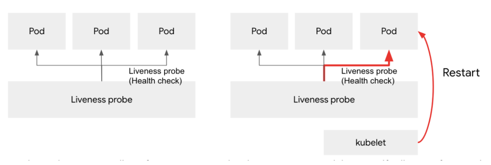
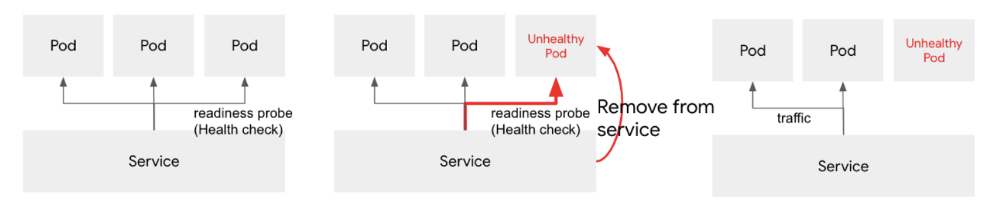

# kubernetes의  Health Check

* kubernetes는 다양한 pod들이 Node에 할당되어 동작한다.
* pod들은 기본적으로 `mutable`한 속성을 가지고 있어서 언젠가는 꼭 한번 이상 죽을 것이라는게 가정되어
있다.
* 이러한 성질때문에 pod들이 살아있는지 health check를 해주는 것이 필요하다.
  * 문제가 있는 pod은 제외시킨다.
  * 문제가 있는 pod은 재시작한다.
* kubernetes 는 이런 헬스체크를 위해 2가지를 제공한다
  * Liveness probe : 컨테이너 애플리케이션이 문제가 생긴다면 앱을 재시작한다.

  

  * Readiness probe : 컨테이너 애플리케이션이 문제가 생겼고, configuration 등의 문제로
  앱을 재시작 한다 하더라도 애플리케이션을 정상적으로 실행할 수 없을 때, 서비스 노드에서 제외시킨다.

  
