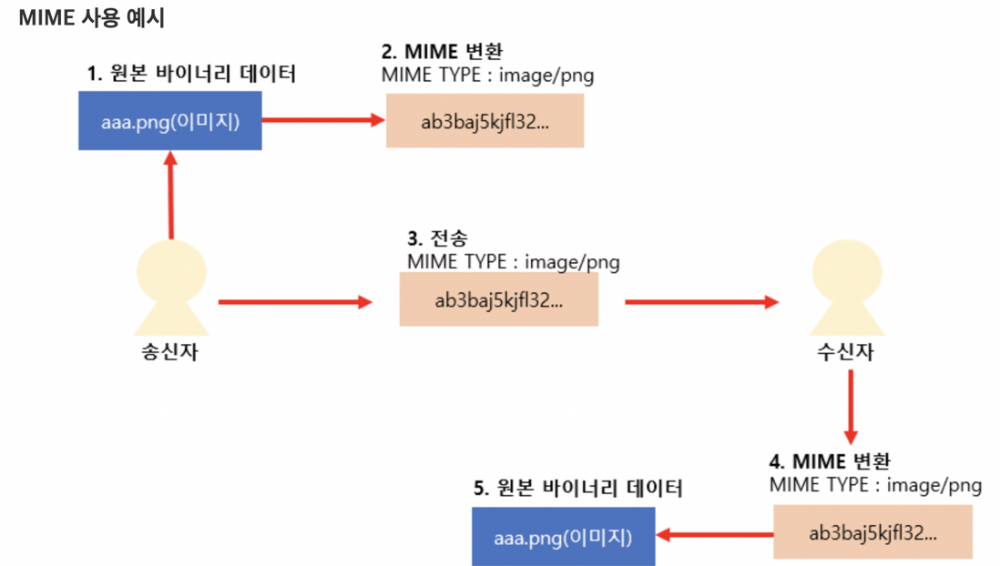

# [TIL] Mime 이란?

* MIME 타입이란 클라이언트에게 전송된 문서의 다양성을 알려주기 위한 메커니즘이다.
* MIME의 약자는 `MULTIPURPOSE INTERNET MAIL EXTENTION` 인데, 이름을 보면 `다목적 인터넷 메일 확장자` 이다.
* 이름에서 보면 알 수 잇듯이 처음에는 메일을 위해서 만들어진 확장자이다.
* 메일에서는 아래와 같은 문제가 있었다.
* 예전에는 ASCII 코드를 사용하여 전송을 하였는데, 이때문에 전송할 수 있는 것이 문자만 가능했다.
* 즉 문자 데이터 이외의 바이너리 데이터 (이미지, 동영상..) 등은 전송할 수 없었다.
* 때문에 여러 멀티 미디어 데이터들의 바이너리 데이터를 ASCII 로 변경하고, 해당 미디어의 정보를 Mime 타입으로 정의했다.
* 이러한 Mime 타입이 정의되어 있지 않으면 수신측에서는 이 ASCII가 문자열인지 이미지인지 동영상인지 알수 없기 때문이다.
* MIME 타입을 이용하여 수신측에서 ASCII 를 원래의 멀티미디어 바이너리로 변환하여 해석한다.
* __처음은 메일을 위해서 나왔지만, 지금은 HTTP 통신의 전송 데이터를 표현하기 위해서도 사용하고 있다.__

### 참고

* https://dololak.tistory.com/130
