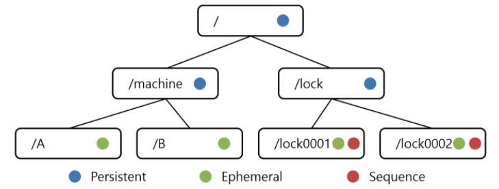

# 분산 처리 환경에서 사용 가능한 데이터 저장소, Zookeeper

* Goal
  * Zookeeper 에 대해서 살펴보고 이해한다.

## Zookeeper 란?

* Zookeeper 는 `분산 작업을 제어하기 위한 트리 형태의 데이터 저장소`라고 할 수 있다.
* 기능 자체로는 간단해보인다. 우리는 ZooKeeper의 다양한 클라이언트 라이브러리를 통해서
트리의 특정 노드에 데이터를 저장하고 변경할 수 있고, 또 그러한 데이터를 가져올 수 있다.
* 기능은 심플해보이지만, 분산 서버 환경에서는 활용분야가 넓다.
  * 서버 간의 정보를 공유 할 때, 공유하기 위한 정보 관리를 위해 사용할 수 있다. (설정 정보, 상태 정보 등..)
  * 서버 투입 / 제거 시 이벤트 처리
  * 서버 모니터링
  * 시스템 관리
  * 분산된 서버들간에 동기화 작업이 필요한 경우
* 또 Zookeeper 의 주요한 기능중 하나인 `Watcher`를 사용하면, 특정 노드 데이터에 변화가 감지되면
클라이언트에게 콜백을 통해 변경 여부를 알려줄 수도 있다.

## Zookeeper 의 노드

* 이러한 주키퍼는 위에 이미지 처럼 `ZNode`구조의 트리 형태로 되어있다.
* `ZNode` 에는 한번 저장하면 영구적으로 유지되는 __영구 노드 (Permanent Node)__ 외에도
클라이언트 세션이 유효한 동안만 살아 있는 __임시 노드 (Ephemeral Node)__ 와 저장하는 순서에 따라
자동으로 일련번호가 붙는 __순차 노드 (Sequence Node)__ 가 있다.
* 각각의 노드는 어디에 사용할 수 있을까?
  * 영구 노드
    * ZNode의 기본 노드로 한번 저장되고 나면 세션이 종료되어도 서버에 영구적으로 저장한다.
    * __즉, 명시적으로 삭제하지 않는 한 해당 데이터는 삭제 및 변경되지 않는다.__
    * 영구적으로 저장해서 관리를 해야할 설정, 메타정보 등에 활용할 수 있다.
  * 임시 노드
    * 임시 노드는 특정 세션이 살아있는 동안 그 노드의 데이터가 유효한 노드이다.
    * ZooKeeper에 접속한 클라이언트가 특정 노드를 임시 노드로 생성했다면, 클라이언트와 서버간의
    세션이 끊어지면, 해당 노드는 __자동으로 삭제 된다.__
    * 이 기능을 사용하면 어떤 클라이언트가 유효한지 안한지를 쉽게 알 수 있다.
  * 순차 노드
    * 순차 노드는 노드 생성시 __sequence number__ 가 자동으로 붙는다
    * 예를 들어서 `/a` 라는 노드의 자식으로 `/b` 노드를 생성하면 아래와 같이 4byte 의 시퀀스 노드가
    붙는다
    * ex) `/a/b0000000001`, `/a/b0000000002`

## ZooKeeper 의 앙상블

* 분산 작업을 제어하기 위해 사용되는 만큼 ZooKeeper 서버가 중단되면 ZooKeeper에 의존하는
모든 서버가 영향을 받는다
* 따라서, __Zookeeper는 최대한 정상 동작을 해야한다.__
* ZooKeeper 는 이를 위해 여러대의 ZooKeeper 서버를 클러스터링 하여 고가용성을 지원하도록
설정할 수 있다.
* 이 __ZooKeeper 클러스터를 앙상블 이라고 부른다.__
* ZooKeeper 서버는 클러스터를 구성할 때, `선거 방식`을 사용하여 `리더` 서버와 `팔로어` 서버를 결정한다.
* __`리더`로써 선출되면 `Write` 명령을 수행할 수 있다.__
* 나머지 서버는 __팔로워 역할로 `Read`를 수행한다.__
* 위와 같이 구성되기 때문에 __`Read` 작업이 많고, `Write` 작업은 상대적으로 작은 경우에 ZooKeeper 는
하나의 선택지가 될 수 있다.__
* ZooKeeper 클라이언트는 커넥션 문자열에 포함된 ZooKeeper 주소 중 하나에 접근하여 세션을 맺는다.
* 클라이언트가 전달한 Read 명령은 현재 연결된 ZooKeeper 서버에서 바로 반환한다.
* 이에 비해 `Write` 명령은 앙상블 중 리더 역할을 수행하는 ZooKeeper 서버로 전달되며, 리더 ZooKeeper 는
모든 팔로어 ZooKeeper 에 해당 쓰기를 수행할 수 있는지 질의한다.
* 만약 팔로어 중 과반수의 팔로어로 부터 쓰기 명령을 수행할 수 있다는 응답을 받으면, 리더는 팔로어에게
데이터를 쓰도록 지시한다.

* 만약 연결을 맺은 Zookeeper 서버에 문제가 생겨서 세션이 종료되면, 다른 Zookeeper 서버로 재 접속을
시도한다.
* ZooKeeper에서 제공하는 앙상블을 유지하기 위해서는 __최소 3대의 서버로 구성해야한다.__

### 참고)

* https://ssup2.github.io/theory_analysis/ZooKeeper/
* https://d2.naver.com/helloworld/583580
