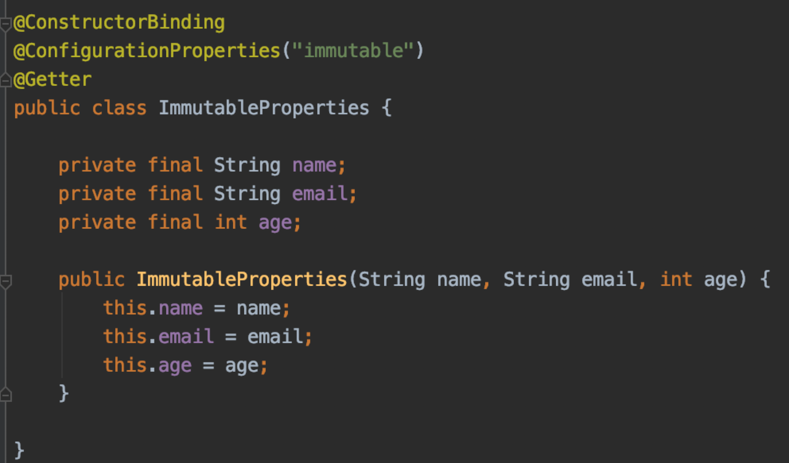
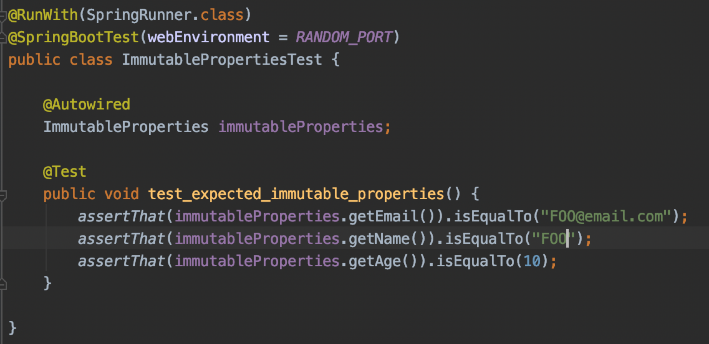

# Spring boot 2.2 부터 Immutable properties 사용 가능

* spring boot 2.2 부터 Immutable한 property 객체를 선언하고 사용할 수 있다.
* 제일 처음에 immutable 프로퍼티 제안이 나온 것은 코틀린의 `data class`에서 호환성 문제로 제기되었다.
* immutable property를 생성자를 통해서 생성하기 위해서는 `ConstructorBinding`을 선언해주어야 한다.

## 예제

## 테스트

