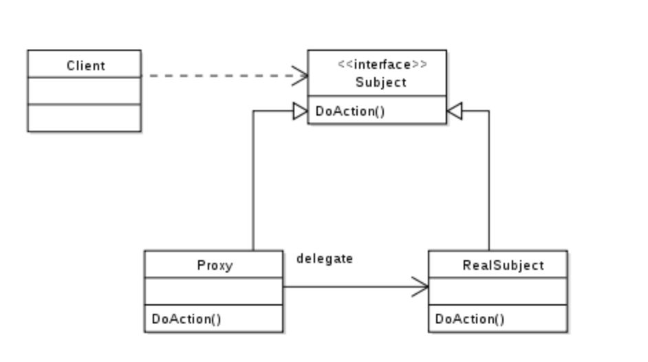

# [TIL] 스프링 AOP 살펴보기 - 프록시패턴과 AOP

* 스프링에서 AOP에 대한 구현은 프록시 패턴을 이용하여 구현되었다.
* 프록시 패턴이 무엇인지, 그리고 스프링에서 이러한 프록시 패턴을 이용해서 어떤식으로 AOP를
구현하는지 살펴보자.

## 프록시 패턴이란?

* 프록시 패턴은 __실제 작업__ 을 행하는 오브젝트와 이를 감싼 __프록시 오브젝트__ 로 이루어진다.
* 프록시 패턴은 이름을 __참 잘 지은것 같다.__ 프록시는 결국에 어떤 요청을 받고 그 요청에 대한 처리는 다른 쪽에 `위임`하기 때문이다.
* 이런 프록시 패턴이 필요한 이유는 __실제 작업__ 을 __실행하기 전 또는 후__ 에 다른 작업을 추가하기 위해서
사용을 한다.
* 프록시 패턴의 구현을 이루는 컴포넌트들은 아래와 같다.
  * 인터페이스
  * 인터페이스를 구현한 실제 작업을 위한 객체
  * 인터페이스를 구현한 프록시 객체



* 위의 이미지를 살펴보면, `Client`는 `Interface` 를 사용한다.
* 클라이언트에서 사용되는 Interface Subject 의 구현체는 `RealSubject` 가 아닌 `프록시 객체`가 주입된다.
* 이 프록시 객체를 통해 `doAction` 함수가 호출 될  때, 실제 `RealSubject` 를 호출하기전에 우리는 여러 비즈니스
로직을 메소드의 전, 후로 추가할 수 있다.

## 프록시 패턴에 대한 예제

```
[RealSubject.class]

public class RealSubject implements Subject {

  @Override
  public void doAction() {
    System.out.println("DOACTION!")
  }

}
```

```
[ProxySubject.class]

public class ProxySubject implements Subject {

  private final Logger logger = LoggerFactory.getLogger(ProxySubject.class);
  private final RealSubject realSubject = new RealSubject();

  @Override
  public void doAction() {
    logger.debug("doAction이 실행되었습니다.")
    realSubject.doAction();
  }

}
```

```
[Client.class]

public class Client {

  private final Subject subject;

  pubic Client(Subject subject) {
    this.subject = subject;
  }

  public void sendMessage() {
    subject.doAction();
  }
}
```

```
[Main.class]

public class AppRunner {

  public static void main(String[] args) {
    Subject proxySubject = new ProxySubject();
    Client client = new Client(proxySubject);
    client.sendMessage();
  }
}
```

```
[OUTPUT - 결과 값]

doAction이 실행되었습니다.
DOACTION!
```

* 좀더 구체적으로 살펴보자. 위에 `ProxySubject`는 `RealSubject` 객체를 멤버변수로 갖고 있다.
* `RealSubject` 와 __동일한 인터페이스를 구현__ 함으로써 같은 메소드를 지니게 한다.
* `Client`의 코드를 살펴보면, `sendMessage` 를 할 때, `subject.doAction`을 호출하고 있다.
* 이때, 주입되는 객체는 `Subject` 인터페이스를 구현한 `ProxySubject` 객체이다.
* `ProxySubject`는 결국 `RealSubejct`를 감쌌기 때문에, __doAction__ 이 호출되기 전, 후에 새로운
로직을 넣을 수 있다.
* 이때, `Client`, `RealProject`의 __코드 변경 없이 새로운 코드를 추가할 수 있다.__
* 이는 자바 SOLID 원칙 중 __개방 폐쇄 원칙__ 을 준수한다고도 할 수 있다.

## 스프링 AOP 에서는 어떻게 프록시 패턴을 이용하여 동작할까?

* 스프링 내부에서는 빈을 등록할 때, __내가 등록한 Bean 대신, BeanProxy가 등록되어 AOP가 구현된다.__
* JPA 에서 `@Transactional` 어노테이션 또한 Spring의 AOP의 한 예이다.
* `@Transactional`은 하나의 쿼리가 실행 될 때, 쿼리가 성공한다면 `commit`하고 실패하면 `Rollback`을
실행하여서 트랜잭션의 성질을 만족시킨다. (원자성, 일관성, 독립성, 영속성)
* 그렇기 때문에, transaction 을 하게되면 쿼리의 앞 뒤로 __반복되는 코드들__ 이 필요해진다.
* 이러한 트랜잭션에 대한 반복되는 코드의 관심사를 AOP 를 이용하여 따로 분리한 것이다.
* 그럼 어떻게 동작이 되는걸까? `@Transactional` 어노테이션을 좀 더 파고들어가보자.

### 참고

* https://m.blog.naver.com/gracefulife/220650929598 (자바 Proxy Pattern(프록시 패턴) 이란)
