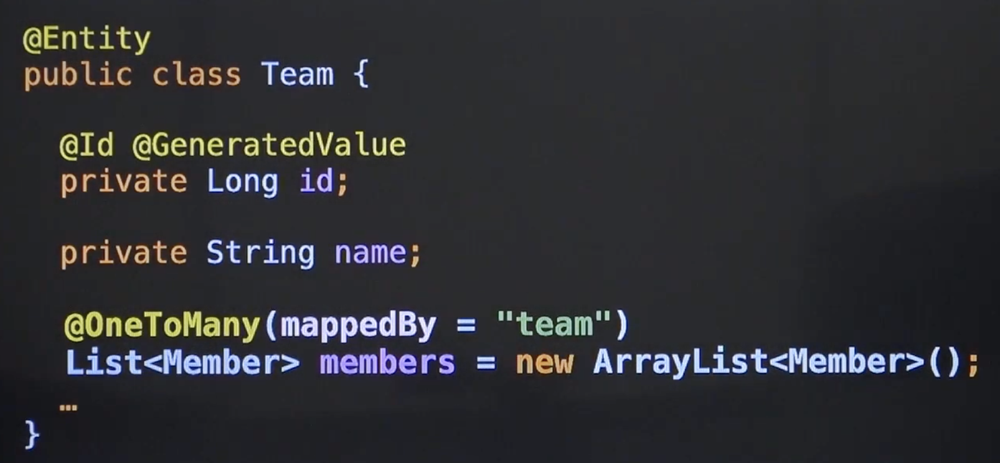
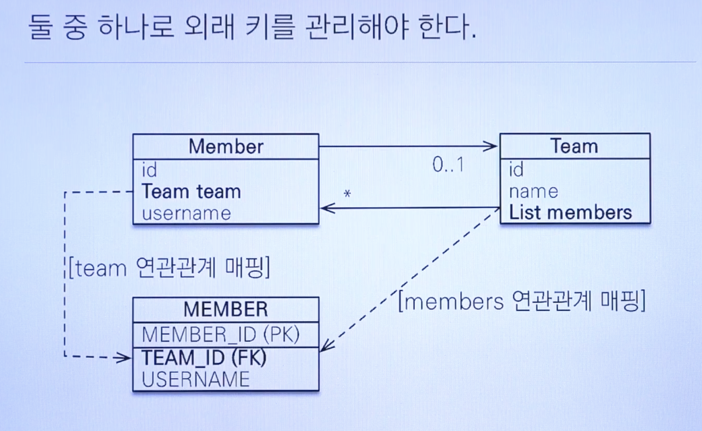
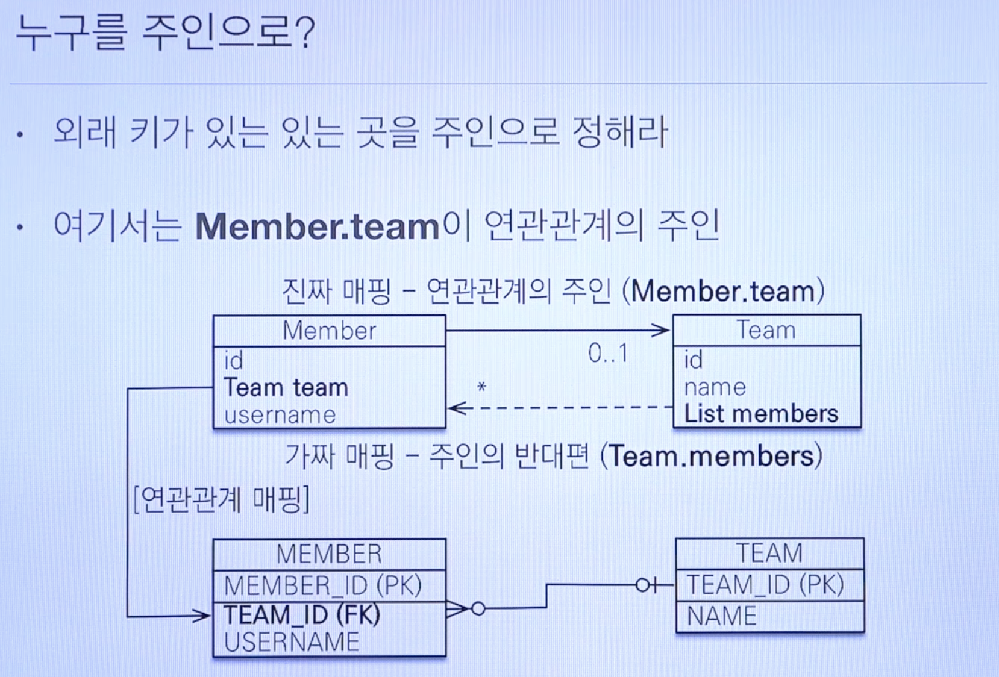
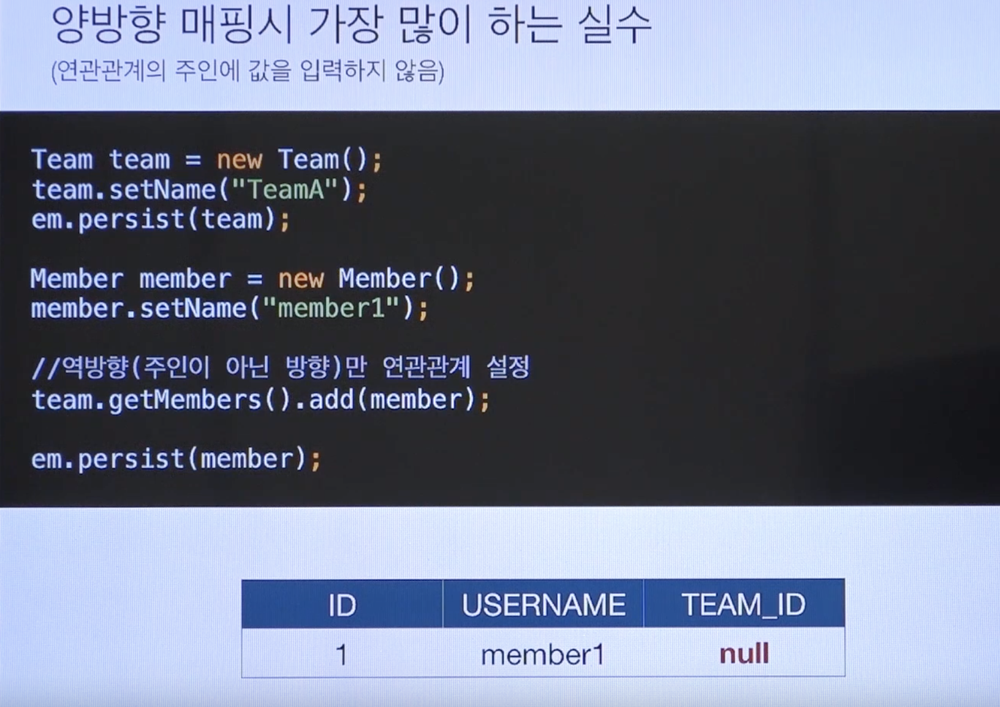

# Spring Data Jpa 양방향 연관관계

* 위의 이미지 처럼 `Member` 에서도 호출할 수 있고, `Team`에서도 호출할 수 있도록 양방향 관계는 어떻게 할 수 있을까
* 데이터베이스에서는 이미 양방향 관계가 가능하다.
* 객체에서는 서로가 서로를 알고 있어야 한다.
* 여기서 사용하는 것은 `@OneToMany` 어노테이션이다.

* 위와 같이 선언하면 이제 `Team`에서 `Team`에 속한 모든 `Member`들을 가져올 수 있다.

## 양방향 관게에서 `mapped by`는 왜 필요할까?

* 그 이유는 바로 누가 `FK`를 수정할 수 있는 권한을 갖는지 설정하기 위함이다.
* Memmber에서 `setTeam`을 통해 `FK`를 수정할 수가 있다.
* 그 이유는 Member가 `FK`를 수정할 수 있는 권한이 있었기 때문이다.
* 반대로 `Team`에서 `setMembers`를 통해서 멤버를 설정하면, 해당 멤버들의 모든 `FK`가 변경된다.
* 이렇게 `Member`에서도 되고 `Team`에서도 FK를 수정하니 혼란이 가중되었다.
* 기본적으로 __객체는 단방향 관계이기 때문에 위와 같은 혼란이 발생한 것이다.__
* 그래서 양방향 관계에서는 한쪽에서만 `FK`를 수정하고, 한쪽에서는 `READ`만 가능하게 설계하기 위해 `mapped by`를 만들었다.
* `mapped by`가 붙어있는 쪽이 바로 읽기만 가능한 쪽이다.

* 위 이미지를 보면, 둘다 `FK`를 수정하면 컨텍스트 이해가 어려워진다.

* 그래서 위 이미지 처럼 한쪽에서만 접근이 가능하도록 한 것이다.
* 이런 차이를 모르고 Team에서 Member를 수정했는데 __왜 `FK`가 안바뀌지?__ 하는 사례가 꽤 많다.

* 이 차이를 잘 모르면 위와 같이 __권한이 있는 주인에서 수정하지 않아서 `FK`가 `NULL`로 설정 되는 경우가 많다.__
