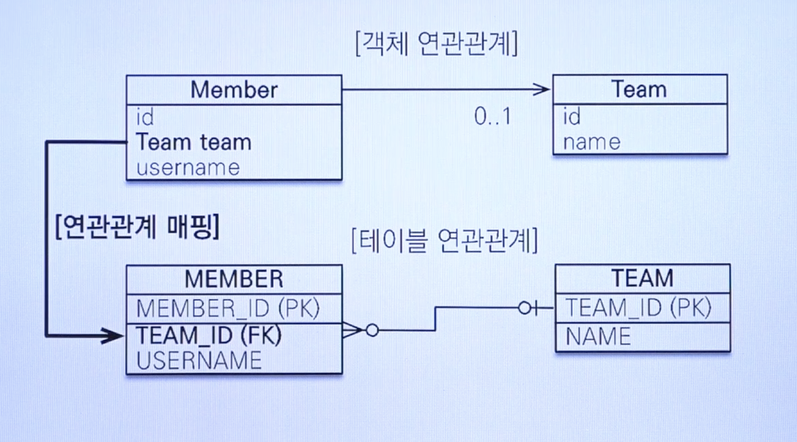
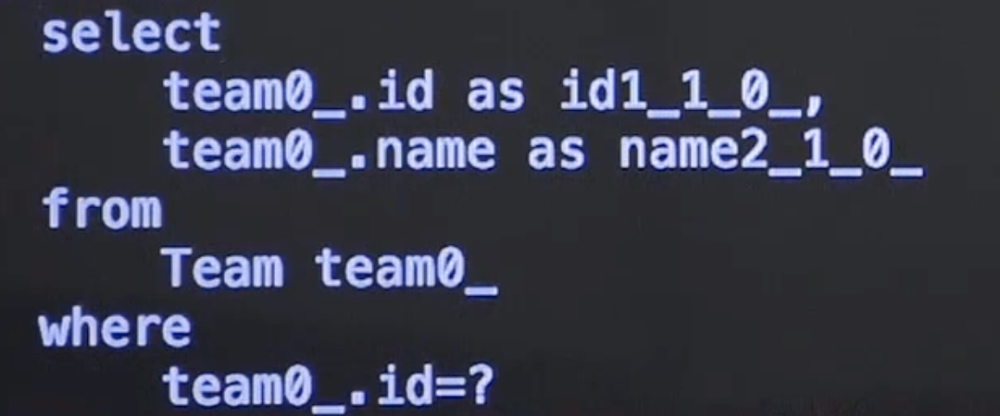

# JPA 연관관계 - 단방향 매핑

* JPA는 어노테이션을 통해 조인된 테이블을 객체로 한번에 쉽게 가져올 수 있다.
* 예를 들어, Team <- Member (1 대 다 구조) 라면.
* JPA에서 조인을 사용하지 않고 Member를 통해 팀을 가져오려면?
* 2번의 쿼리를 해야한다. Find member 후, member의 소속팀 ID를 가지고 Team을 쿼리해서 가져온다.
* 이를 `Spring Data JPA` 에서 ``@ManyToOne`을 통하면 조인쿼리를 객체에 매핑하여 객체 역직렬화까지 한번에 사용하며, `getTeam` 메소드로 쉽게 관계 정보를 얻을 수 있다.



* 위와 같이 연관관계 매핑을 위해 아래와 같이 선언을 할 수 있다.

```
// Private long teamId; 대신 아래와 같이 작성 가능하다.
// teamId를 선언하는 것은 객체 답지 않고 SQL 쿼리 지향적이다.

@ManyToOne
@JoinColumn(name = “TEAM_ID”)
private Team team;

```

* 위와 같이 선언 후, setTeam과 getTeam을 선언하면, 이제 객체로서의 활용도가 올라간다.
* 그렇다면 실제로 위와 같이 선언하면 어떤 쿼리가 발생하는걸까




* 쿼리를 보면, 멤버에 team_id를 통해서 TEAM 테이블과 `Left Outer join`을 하는 것을 볼 수 있다.
* 이것을 자동으로 해주고, 우리는 `getTeam`을 통해 객체로 접근도 가능하다.
* 추가적으로 Lazy 하게 로드하는 옵션도 존재한다.
* @ManyToOen(fetch = FetchType.Lazy) 라고 선언하면, 바로 조인을 하지 않고 member 만 가져온다.
* 이후, getTeam을 하면, 그때서야 Team 을 가져온다. 지연 로딩을 하게된다. (필요할때만 사용.)
  * 현업에서 권장하는 것은 전부다 `Lazy`를 사용하세요. 라는 것이다.
  * 왜냐면 필요할때만 조인해서 가져오면 되지 필요없는데 조인해서 가져오면 성능 낭비이기 때문.
  * 물론, 바로 사용해야할 경우에는 Lazy 하게 사용하지 않으면 된다.
